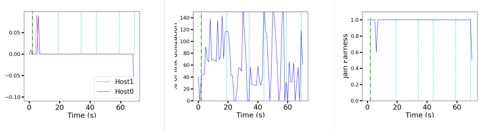
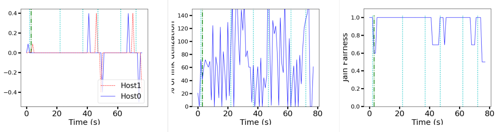
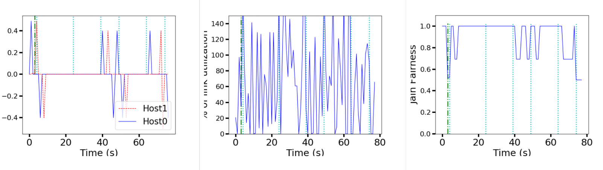
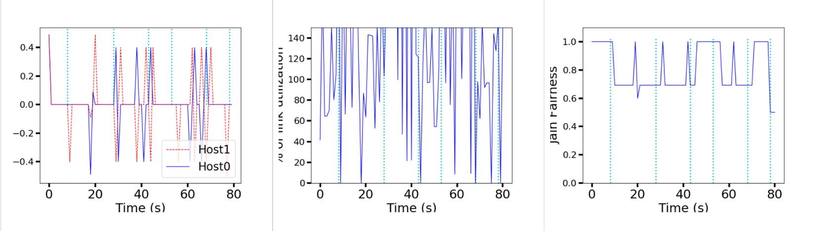
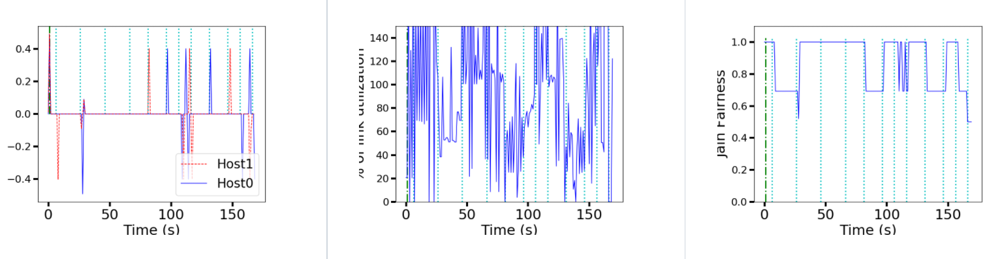

# Report
|Member|SID|Contribute|
|---|---|---|
|丛哲渊|11912106|1|
|张通|11911611|1|
|张坤龙|11911716|1|

## Proxy

### Onelink 

#### alpha = 0.1

#### alpha = 0.5

#### alpha = 0.9

As we can see clearly,the bigger alpha is,the bigger the change and frequency  of the derivative of BR is.
The bigger alpha is,the more frequent the link of utilization change.
### sharelink alpha = 0.9

For sharelink,we can see that the jain fairness grows up and down between 0.5 and 1. 1 means absolute fairness and when bandwith changes ,the fairness goes down to 1.And when bandwith does not change ,the TCP will make the fairness increase and stable at 1.
### twolink alpha = 0.9

The change and frequency  of the derivative of BR and link utilization of twolink are larger than onelink.

The change and frequency  of the derivative of BR and link utilization of onelink are larger than sharelink.
